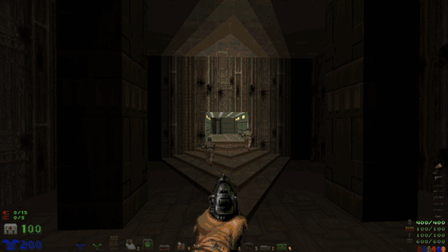

  

## About

Doomventory hud is a graphical interface for UZDoom to manage inventory items and weapons. It is generic and compatable with many other mods although compatability is not guaranteed. The interface uses primarilly mouse controls. The interface is also customizable with some presets.

##  Using Doomventory Hud

Simply downlaod the .pk3 file from the releases and launch with UZDoom.

## Status

Many major issues are still present.
	

		- The inventiory function is tied to the statusbar requiring the base inventory bar to be active and visible.
	

	

		- scrolling through weapons does not function as intended based on user selection 
	

